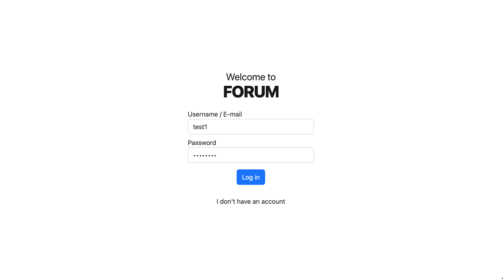
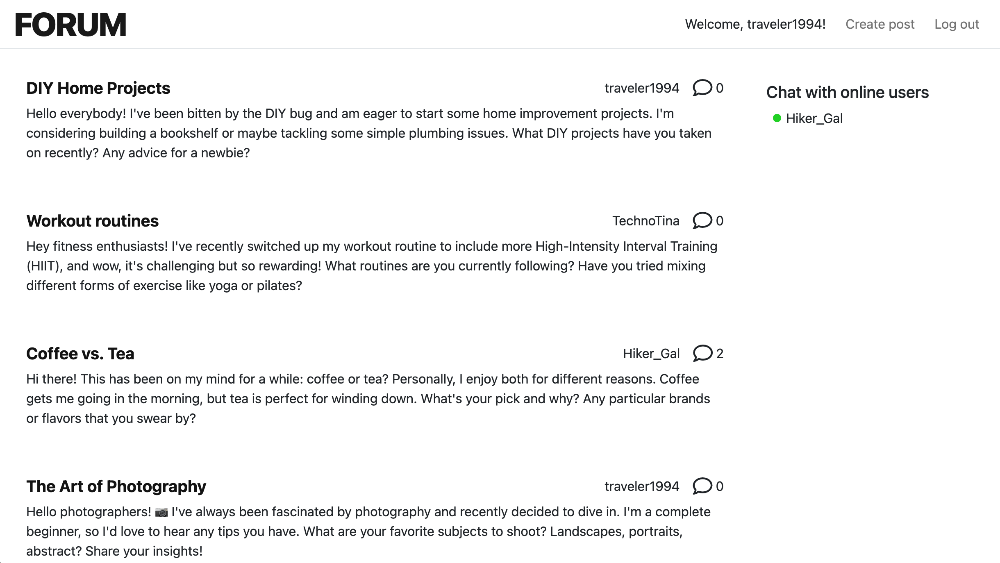
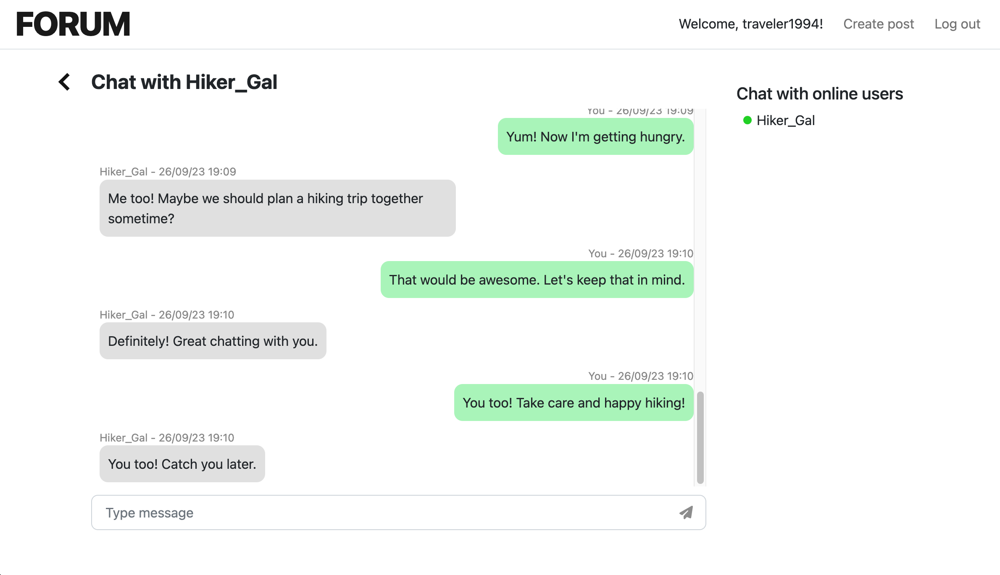

# Real time Forum

## Description

Real-time web forum that allows users to register, create posts, comment on posts, and send private chat messages to one another using Gorilla websocket

## Authors

Erik Hans Sepp (eriksepp)  
Olena Budarahina (obudarah)

## Technologies used

Frontend:
- HTML, CSS, JS
- Bootstrap 5.2

Backend:
- Go
- SQLite
- Gorilla websocket

## Running

This project uses the Gorilla WebSocket package for handling WebSocket connections.
Ensure you have this package installed before attempting to run the server.
For installation run the following command in your terminal:

`go get github.com/gorilla/websocket`

If you have the Gorilla Websocket installed run the Go server with:

`go run .` from command line to run on port 8080

For other port use `go run . --p=PORT_NR` or `go run . --port=PORT_NR`

## Screenshots
 
 
 

## Dummy users for testing (With chat messages)

| Username | Email | Password |
| ----------- | ----------- | ----------- |
| test1 | test1@forum | test1 |
| test2 | test2@forum | test2 |
| traveler1994 |johnsmith@email.com | testtest |
| Hiker_Gal | jane@hike.com | testtest |
| GreenGuru | laura@flower.com | testtest |
| TechnoTina | tina@techno.com | testtest |

Between traveler1994 and Hiker_Gal there are 36 chat messages  
Between traveler1994 and GreenGuru there are 10 chat messages
